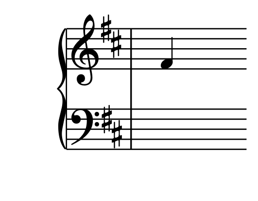
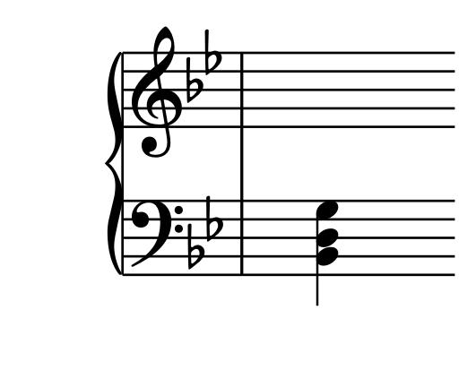

# notation-flashcards

Install and run like so:

```bash
pip install .
NEOSCORE_HEADLESS=1 python -m notation_flashcards
```

This will generate a file called `accordion.apkg` which you can then import into Anki in the usual way.

## What's in the deck?

The deck contains two kinds of Anki notes, "note" notes and "chord" notes.
A "note" note teaches you to name a note in a given key signature:

| *Field*       | *Example Content* |
|---------------|-------------------|
| NID           | 001038            |
| Key Signature | D                 |
| Note Name     | F♯                |
| Octave        | 0                 |
| Score         |  |

We generate one Anki note for each note of the chormatic scale across four octaves,
starting two octaves below middle C and ending two octaves above.
Chromatic scale notes are named such that each letter A-G appears once,
e.g. the note 6 semitones above C is called F♯ in the key of D but G♭ in the key of B♭.

A "chord" note teaches you to name a chord in a given key signature:

| *Field*       | *Example Content* |
|---------------|-------------------|
| NID           | 001425            |
| Key Signature | B♭                |
| Chord Name    | Gm                |
| Inversion     | 1                 |
| Staff         | bass              |
| Score         |  |

There is an Anki note for every three-note chord that a Stradella bass accordion can play (major C, minor Cm, seventh C7 and diminished C°), in every inversion, on both staves.

The notes and chords are taught key by key, in the order of number of sharps and flats (C, G, F, D, B♭, ...).

## Developer notes

The two main module this code uses are `genanki` and `neoscore`.
`neoscore` require PyQt5 which can be tough to install on OSX.
In particular poetry tries to install pyqt5-qt5,
which has no installation candidates for apple silicon.
Perhaps this will be fixed.
In the mean time, I manually remove the entry for pyqt5-qt5 from the lockfile.

`NEOSCORE_HEADLESS=1` isn't necessary, it just makes the program run a little faster.


